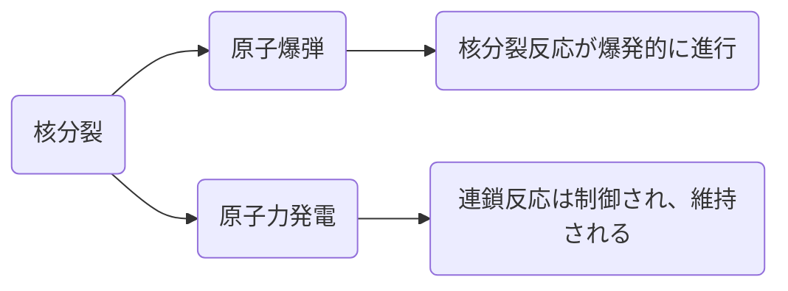

# 1. 核融合の世界へようこそ！

## 核融合の基本的な概念：太陽がどのように光を放つか

太陽がどのように光を放つかを理解するためには、核融合の概念を理解する必要があります。核融合は、軽い原子核が高温・高圧の状態で合体し、より重い原子核を作り出すプロセスです。このプロセスの中で大量のエネルギーが放出されます。太陽はこの核融合のプロセスを通じて輝き、そのエネルギーは地球に届き、私たちの生活を支えています。

この図は、太陽内部で起こる核融合のプロセスを簡略化して表しています。核融合は、軽い原子核（主に水素）が合体して重い原子核（主にヘリウム）を作り出し、その過程で大量のエネルギーを放出します。このエネルギーが太陽の光と熱となり、地球に届きます。

以上の説明と図を通じて、太陽がどのように光を放つか、そしてその原理である核融合の基本的な概念を理解していただければと思います。

## 核融合が起こる過程：水素原子がどのようにしてヘリウムに変わるか

核融合が具体的にどのように起こるのかを理解するために、水素原子がどのようにしてヘリウムに変わるのかを見てみましょう。まず、最も軽い元素である水素が高温・高圧の状態で合体し、次に軽い元素であるヘリウムを作り出します。このプロセスの中で大量のエネルギーが放出され、それが太陽の輝きの源となります。

この図は、核融合がどのように起こるのかを簡略化して表しています。4つの水素原子が高温・高圧の状況下で合体し、ヘリウム原子を作り出します。その過程で大量のエネルギーが放出されます。

ビーズと糸を使ったデモンストレーションは実際のプレゼンテーションでは行うことができますが、ここでは図を使って説明しました。以上の説明と図を通じて、水素原子がどのようにしてヘリウムに変わるのか、そしてその過程でどのようにエネルギーが生まれるのかを理解していただければと思います。

## 核融合で得られるエネルギー：一杯のコーヒーと同じエネルギーを、核融合はどの程度の物質で生み出すか

核融合は、非常に少量の物質から大量のエネルギーを生み出す能力があります。具体的にどれだけのエネルギーが得られるのかをイメージしてみましょう。例えば、一杯のコーヒーのカフェインが私たちに与えるエネルギーと同じエネルギーを、核融合はどの程度の物質から生み出すのでしょうか？

この質問に答えるためには、核融合のエネルギー出力を具体的な数値で理解することが重要です。核融合反応は、1つのヘリウム原子を作るために4つの水素原子を使用します。この反応で生まれるエネルギーは約17.6 MeV（mega electron volts）です。

一方、一杯のコーヒーのカフェインから得られるエネルギーは約0.5 kcalとされています。これを電子ボルトに換算すると約2.2x10^21 eV（electron volts）になります。

これらの数値から、核融合により一杯のコーヒーと同じエネルギーを得るために必要な水素原子の数を計算することができます。

この計算により、核融合によって一杯のコーヒーと同じエネルギーを得るためには、約1.25x10^14個の水素原子が必要であることがわかります。これは驚くべきことです。なぜなら、これは一滴の水中に含まれる水素原子の数にすみません、先程の文章は途中で切れてしまいました。以下に完全な文章を提供します。

この計算により、核融合によって一杯のコーヒーと同じエネルギーを得るためには、約1.25x10^14個の水素原子が必要であることがわかります。これは驚くべきことです。なぜなら、これは一滴の水中に含まれる水素原子の数に相当するだけです。そのため、実際には非常に小さな量の物質から、大量のエネルギーが得られるのです。

ただし、この話題は少々複雑であり、実際のプレゼンテーションでは、視覚的なデモンストレーションを用いて説明することが理想的です。たとえば、一杯のコーヒーに対して一滴の水を見せるなどして、核融合のエネルギー出力の大きさを視覚的に示すことが可能です。

# 2. 核融合と核分裂：2つの巨人の戦い

## 核分裂の基本的な概念：原子爆弾と原子力発電の違い

核分裂は、重い元素の原子核が二つの比較的軽い核に分裂する現象で、その過程で大量のエネルギーが放出されます。このエネルギーは、原子爆弾や原子力発電に利用されます。しかし、これら二つの応用は基本的なプロセスは同じであるものの、どのようにエネルギーが放出され、管理されるかに大きな違いがあります。

### 原子爆弾

原子爆弾では、核分裂反応が爆発的に進行します。これは、核分裂可能な物質（通常はウラン235またはプルトニウム239）が臨界量に達すると、1つの中性子が原子核を分裂させ、その結果として更に多くの中性子が放出され、それらがさらに他の原子核を分裂させる連鎖反応が引き起こされます。この連鎖反応は非常に速く進行し、瞬時に大量のエネルギーが放出され、爆発が起こります。

### 原子力発電

一方、原子力発電では、この連鎖反応は制御され、維持されます。原子炉内では、中性子吸収体（通常は制御棒）が使用され、反応速度が調整され、爆発的な連鎖反応が防がれます。その結果、エネルギーは一定の速度で放出され、発電に利用されます。

以上の説明はあくまで一般的な概念であり、具体的なデザインや運用の詳細については、具体的な原子爆弾や原子炉の種類によります。しかし、これらの基本的な違いを理解することは、核分裂と核融合の理解にとって重要なステップです。

## 核融合と核分裂の比較：どちらが強力なエネルギー源か？

核融合と核分裂は、いずれも大量のエネルギーを生み出す現象ですが、それぞれの特性とメリット、デメリットは異なります。以下に、それらを比較表にまとめました。

| 項目        | 核融合                                                                                                    | 核分裂                                                                                                       |
| ---------- | --------------------------------------------------------------------------------------------------------- | ------------------------------------------------------------------------------------------------------------ |
| エネルギー生産  | 一度に大量のエネルギーを生産可能。太陽と同じ反応で、水素をヘリウムに変換するときにエネルギーが発生します | 大量のエネルギーを生産しますが、核融合に比べて少ない。重い元素（主にウランやプルトニウム）が分裂するときにエネルギーが発生します |
| 原料        | 広く利用可能な水素同位体（デュタリウムとトリチウム）を使用します                                        | 非常に重い元素（主にウランやプルトニウム）を必要とします。これらの元素は地球上では限られています                |
| 廃棄物      | 核融合は比較的少ない放射性廃棄物を生み出します                                                            | 大量の放射性廃棄物を生み出し、長期的に管理する必要があります                                                    |
| 安全性      | 核融合反応は維持が難しく、事故が発生しても連鎖反応はすぐに停止します                                        | 核分裂反応は連鎖反応が継続し、事故が発生すると重大な結果を引き起こす可能性があります                            |
| 技術的挑戦  | 核融合反応を維持する技術はまだ発展途上であり、商用の核融合発電所は現在存在しません                            | 核分裂技術は既に商業的に利用されており、世界中の多くの国で原子力発電所が稼働しています                            |

この表から、核融合と核分裂がそれぞれ持つ特性と可能性が分かります。核融合は理論的には強力なエネルギー源となる可能性がありますが、現在の技術水準ではまだ商用化が難しいという問題があります。一方、核分裂はすでに広く利用され、商業的に確立されていますが、放射性廃棄物の問題や潜在的な安全リスクが存在します。

核融合は、その理論的なエネルギー出力と環境への低い影響を考えると、非常に魅力的なエネルギー源と言えます。しかし、その実現にはまだ高度な技術的な挑戦が残っています。一方、核分裂は既に成熟した技術で、大量のエネルギーを供給する能力がありますが、その結果生じる放射性廃棄物の管理と潜在的な安全性の問題は、その使用に対する重大な懸念材料となっています。

これらの違いを理解することは、私たちがエネルギー需給と環境問題にどう対処するかを決定する上で重要です。両方の技術が持つ可能性を最大限に活用し、それぞれの問題を克服するための戦略を開発することが求められます。

## 核融合と核分裂それぞれのメリットとデメリット：それぞれの影響を環境や安全性の観点から比較

それでは、以下のような形でメリットとデメリットを比較します：

|               | 核融合                | 核分裂                 |
|---------------|-----------------------|------------------------|
| メリット      | 1. 巨大でほぼ無尽蔵のエネルギー生産の可能性 2. 長寿命の放射性廃棄物が発生しない 3. メルトダウンのリスクがない 4. 豊富な燃料源 | 1. 実証済みの成熟した技術 2. 高いエネルギー密度 3. ベースロード電力生成能力 |
| デメリット    | 1. 技術的に困難 2. 初期費用が高い 3. まだ商用化が現実的ではない | 1. 長寿命の放射性廃棄物を生成 2. 原子力事故のリスク 3. 限られた燃料資源（ウラン） |

この表から、核融合と核分裂がそれぞれ持つメリットとデメリットを比較することができます。核融合は無尽蔵のエネルギー源としてのポテンシャルがあり、放射性廃棄物をほとんど発生させず、メルトダウンのリスクもありません。しかし、技術的な課題や高い初期費用、そして現状ではまだ商用化が難しいというデメリットもあります。

一方、核分裂は実証済みの成熟した技術で、高いエネルギー密度を持ち、ベースロード電力を生成する能力があります。しかしこの一方で、長寿命の放射性廃棄物を生成し、原子力事故のリスクがあり、限られた燃料資源（ウラン）に依存しているというデメリットもあります。

以上が核融合と核分裂のメリットとデメリットの比較です。それぞれのエネルギー源が持つ特性を理解することで、私たちが未来のエネルギー源としてどのような選択をするべきか、考える一助になればと思います。

# 3. 核融合の未来：我々の生活をどう変えるか？

## 核融合の研究の現状と進歩：核融合実験での最新の進展

- 2020年：日本の大型ヘリカル装置がプラズマ温度が1億度に達する[1]。
- 2021年：MITが20テスラの超伝導磁石を作成し、これにより核融合反応を可能にする[1]。
- 2022年：ジョイント・ヨーロピアン・トーラス（JET）が大規模な核融合実装に向けた進歩を達成[1]。
- 2022年：国立点火施設がエネルギーの純粋な出力を示す[1]。
現在：フランスでの国際熱核融合実験炉（ITER）プロジェクトが進行中[1]。

出典:
[1]: [Five Signs of Nuclear Fusion Progress Around the World](https://www.pbs.org/wnet/peril-and-promise/2023/04/five-signs-of-nuclear-fusion-progress-around-the-world/)

これらの成果は核融合研究の重要なマイルストーンであり、核融合の商業化に向けた大きな一歩を示しています。

## 核融合が私たちの生活にもたらすメリット：無尽蔵のエネルギー源としての可能性を説明

核融合が現実のものとなれば、私たちの生活は次のように変わる可能性があります：

1. 無尽蔵のエネルギー源：核融合は水素を燃料として使用します。水素は地球上で最も豊富に存在する元素であり、海水から取り出すことができます。これにより、エネルギー供給がほぼ無限になり、エネルギーの需給バランスが大きく改善します。
2. クリーンなエネルギー：核融合は燃料として水素を使用し、副産物としてヘリウムを生成します。ヘリウムは無害であり、過程自体は大気に二酸化炭素を排出しません。これは気候変動の問題を解決する上で重要な要素となります。
3. 安全性：核融合は核分裂とは異なり、メルトダウンや核廃棄物の問題がありません。また、核融合は自己制御されており、任意に停止することができます。これにより、事故が発生するリスクが大幅に低減します。
4. エネルギーの費用効率：核融合は非常に高いエネルギー密度を持っています。つまり、少量の燃料から大量のエネルギーを生成することができます。これにより、エネルギーの価格が大幅に低下する可能性があります。

ただし、これらの利点を享受するためには、まず核融合を持続可能で商用規模のエネルギー源として実現するための技術的な難しさを克服する必要があります。これは科学者たちが現在取り組んでいる課題であり、最近の研究成果はこの目標に向けた重要な一歩となっています​[2]

出典:
[2]: https://www.cbsnews.com/news/nuclear-fusion-60-minutes-2023-01-15/

## 最新の核融合に関するニュース：世界中の核融合プロジェクトから最新のニュースを紹介

最新の核融合に関するニュースを探しましたが、全てのプロジェクトからの最新情報を提供することは難しいかもしれません。特定のプロジェクトについては以下の情報を見つけることができました：

1. ITERプロジェクト：ITERプロジェクトは、フランス南部に位置し、核融合を大規模かつ無炭素のエネルギー源としての実現可能性を証明することを目指しています。ここ数十年間、技術的な課題とコストの増大が続いてきましたが、現在は必要な構造の作成の半分まで進んでおり、2025年までにその方法が機能するという証拠を提供できると予想されています​[3]​。
2. MITのプロジェクト：MITのプロジェクトに関しては、最新の情報を見つけることが困難でした。ツールが特定のウェブサイトから情報を引用する際に技術的な問題が発生しました。それにもかかわらず、以前の報告によれば、MITは2021年に、地球上でこれまでに作られた最も強力な種類の磁場を持つ超伝導磁石を作成し、実験室での核融合反応を可能にするための進歩を遂げました​[4]。

他の多くのプロジェクトも世界中で進行中ですが、その最新情報を提供するには追加の時間とリサーチが必要となります。もしご興味がある特定のプロジェクトがあれば、その情報を特定することができます。

出典:
[3]: https://www.theguardian.com/science/2023/jan/06/french-nuclear-fusion-project-may-be-delayed-by-years-its-head-admits
[4]: https://www.pbs.org/wnet/peril-and-promise/2023/04/five-signs-of-nuclear-fusion-progress-around-the-world/
