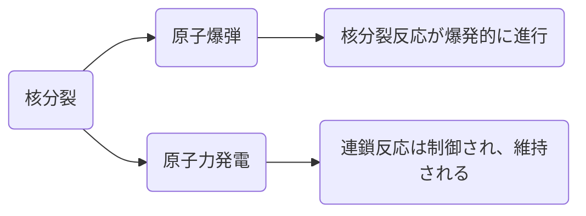

# 1. 核融合入門：「科学オンチ」でも理解できる核融合の世界

## 核融合の驚異 - 太陽がどのように光を放つか？

眩い日光は、まさに核融合の力そのものです。核融合とは、超高温と圧力の中で、軽い原子核が合体してより重い原子核を生み出す、素晴らしい自然現象です。そしてその時に放出されるエネルギーこそが、太陽の輝きとなり、地球上のすべての生命を支えています。

## 核融合のステップ - 水素からヘリウムへ

核融合がどのように起こるのか、もう少し詳しく見てみましょう。基本的なステップは、高温高圧下で軽い元素、水素が合体し、より重い元素であるヘリウムを生み出す、というものです。この過程でエネルギーが大量に放出され、太陽の輝きを作り出します。

## 核融合のエネルギー - 一杯のコーヒーと比較して
核融合は、非常に少量の物質から驚くべき量のエネルギーを生み出す能力があります。具体的には、水から取り出せる水素の量で、一杯のコーヒーと同じエネルギーを生み出すことが可能です。これがどれほどのことかを感じていただくために、具体的な計算を通じて見てみましょう。

これらの計算から、核融合によって一杯のコーヒーと同じエネルギーを得るためには、約1.25x10^14個の水素原子が必要であることがわかります。これは本当に驚くべきことです。その理由は、この量の水素原子は、実はたった一滴の水からでも得ることができるからです。

これらの解説と図解を通じて、核融合の驚異的なエネルギー効率を感じていただけたでしょうか。ただし、この説明はあくまで概念的なものであり、実際の現象はもっと複雑です。そして、核融合を制御してエネルギーを取り出す技術は、まだ発展途上の段階にあります。それでも、その可能性は無限大であり、未来のエネルギー問題の解決に向けて、多くの科学者たちが核融合研究に取り組んでいます。

# 2. 核融合と核分裂：二つの力、その相違点

## 核分裂の基礎：原子爆弾と原子力発電の相違点

核分裂とは、重元素の原子核が二つの比較的軽い核に分裂し、その過程で大量のエネルギーが放出される現象を指します。このエネルギーは原子爆弾や原子力発電に用いられますが、これらの応用法においてエネルギーの放出と管理の仕方には顕著な違いが見られます。

### 原子爆弾

原子爆弾の場合、核分裂反応は爆発的に進行します。核分裂可能な物質（一般的にはウラン235やプルトニウム239）が臨界量に達すると、一つの中性子が原子核を分裂させ、それにより更なる中性子が放出されます。これらの放出された中性子が他の原子核を分裂させる連鎖反応を引き起こし、この反応が極めて速く進行することで大量のエネルギーが瞬時に放出され、爆発が引き起こされます。

### 原子力発電

一方、原子力発電の場合は、連鎖反応は管理されて進行します。原子炉内では中性子吸収体（主に制御棒と呼ばれます）を用いて反応速度を調整し、爆発的な連鎖反応を防ぎます。その結果、エネルギーは一定の速度で放出され、これを発電に用います。

以上の説明は基本的な概念に過ぎません。具体的なデザインや運用の詳細は、具体的な原子爆弾や原子炉の種類によって変わります。しかし、これらの基本的な違いを理解することは、核分裂と核融合の理解への重要な一歩となります。

## 核融合と核分裂：究極のエネルギー源への挑戦

核融合と核分裂は、いずれも大量のエネルギーを生成する可能性を秘めた力強いエネルギー源です。しかし、これら二つは、その特性と利点、欠点で大きく異なります。それぞれの要点を以下の比較表にまとめています。

| 要素        | 核融合                                                                                                    | 核分裂                                                                                                       |
| ---------- | --------------------------------------------------------------------------------------------------------- | ------------------------------------------------------------------------------------------------------------ |
| エネルギー生成  | 太陽と同じ反応を模倣し、水素をヘリウムに変換する際に大量のエネルギーを一度に生産します | 重い元素（主にウランやプルトニウム）が分裂するときに多くのエネルギーを生産しますが、核融合に比べるとエネルギー量は少ない |
| 原材料        | 広く利用可能な水素の同位体（デュタリウムとトリチウム）を使用します                                        | 非常に重い元素（主にウランやプルトニウム）を必要とします。これらの元素は地球上では限定的です                |
| 放射性廃棄物  | 核融合は相対的に少ない放射性廃棄物を生み出します                                                            | 核分裂は大量の放射性廃棄物を生み出し、これを長期間安全に管理する必要があります                                                    |
| 安全性      | 核融合反応は維持が困難で、事故が発生しても連鎖反応はすぐに停止します                                        | 核分裂反応は連鎖反応が続き、事故が発生すると重大な影響を及ぼす可能性があります                            |
| 技術的課題  | 核融合反応を維持する技術はまだ発展途上であり、現在、商用の核融合発電所は存在しません                            | 核分裂技術は既に商業的に利用されており、世界中の多くの国で原子力発電所が運用されています                            |

この表から、核融合と核分裂がそれぞれどのような特性と可能性を持っているかが明らかになります。理論的には、核融合は強大なエネルギー源になる可能性がありますが、現在の技術水準ではまだ実用化が難しいという課題が存在します。一方、核分裂は既に広範囲に利用され、商業的に確立されていますが、放射性廃棄物の問題や潜在的な安全リスクが課題となっています。

理論的なエネルギー出力と環境への低影響を考慮すれば、核融合は非常に魅力的なエネルギー源といえます。しかし、その実現にはまだ大きな技術的挑戦が残っています。一方、核分裂はすでに成熟した技術であり、大量のエネルギーを供給する能力を持っています。しかし、生成される放射性廃棄物の管理と潜在的な安全性の問題は、その利用に対する深刻な懸念材料となっています。

これらの相違点を理解することは、エネルギー需給と環境問題にどう対応するかを決定する上で重要です。それぞれの技術が持つ可能性を最大限に活用し、それぞれの問題を解決するための戦略を策定することが求められています。

## 核融合と核分裂それぞれの長所と短所：環境と安全性の観点からの比較

ここでは、長所と短所を以下のように比較します：

|               | 核融合                | 核分裂                 |
|---------------|-----------------------|------------------------|
| 長所      | 1. 莫大なエネルギー生産の可能性 2. 長期間にわたる放射性廃棄物を発生しない 3. メルトダウンのリスクが低い 4. 豊富な燃料源 | 1. 確立された技術 2. 高いエネルギー密度 3. ベースロード電力生成能力 |
| 短所    | 1. 技術的な課題 2. 高額な初期投資 3. まだ商用化が現実的ではない | 1. 長寿命の放射性廃棄物を生成 2. 原子力事故のリスク 3. 限定的な燃料資源（ウラン） |

この表から、核融合と核分裂がそれぞれの長所と短所を比較することができます。核融合は大量のエネルギー源としてのポテンシャルを持ち、長期間にわたる放射性廃棄物の発生が少なく、メルトダウンのリスクも低いという特徴があります。しかしながら、技術的な難易度や高額な初期投資が必要であり、また現状ではまだ商用化が難しいという短所も存在します。

一方で、核分裂は確立された技術であり、高いエネルギー密度を持ち、ベースロード電力を生成する能力があります。しかし、長期間にわたる放射性廃棄物の生成、原子力事故のリスク、限定的な燃料資源（ウラン）への依存といった短所もあります。

以上が核融合と核分裂の長所と短所の比較となります。各エネルギー源がどのような特性を持つのかを理解することは、未来のエネルギー源を選択する上で重要な要素です。

# 3. 核融合の未来：我々の生活をどう変えるか？

## 核融合の研究の現状と進歩：核融合実験での最新の進展

- 2020年：日本の大型ヘリカル装置がプラズマ温度が1億度に達する[1]。
- 2021年：MITが20テスラの超伝導磁石を作成し、これにより核融合反応を可能にする[1]。
- 2022年：ジョイント・ヨーロピアン・トーラス（JET）が大規模な核融合実装に向けた進歩を達成[1]。
- 2022年：国立点火施設がエネルギーの純粋な出力を示す[1]。
現在：フランスでの国際熱核融合実験炉（ITER）プロジェクトが進行中[1]。

出典:
[1]: [Five Signs of Nuclear Fusion Progress Around the World](https://www.pbs.org/wnet/peril-and-promise/2023/04/five-signs-of-nuclear-fusion-progress-around-the-world/)

これらの成果は核融合研究の重要なマイルストーンであり、核融合の商業化に向けた大きな一歩を示しています。

## 核融合が私たちの生活にもたらすメリット：無尽蔵のエネルギー源としての可能性を説明

核融合が現実のものとなれば、私たちの生活は次のように変わる可能性があります：

1. 無尽蔵のエネルギー源：核融合は水素を燃料として使用します。水素は地球上で最も豊富に存在する元素であり、海水から取り出すことができます。これにより、エネルギー供給がほぼ無限になり、エネルギーの需給バランスが大きく改善します。
2. クリーンなエネルギー：核融合は燃料として水素を使用し、副産物としてヘリウムを生成します。ヘリウムは無害であり、過程自体は大気に二酸化炭素を排出しません。これは気候変動の問題を解決する上で重要な要素となります。
3. 安全性：核融合は核分裂とは異なり、メルトダウンや核廃棄物の問題がありません。また、核融合は自己制御されており、任意に停止することができます。これにより、事故が発生するリスクが大幅に低減します。
4. エネルギーの費用効率：核融合は非常に高いエネルギー密度を持っています。つまり、少量の燃料から大量のエネルギーを生成することができます。これにより、エネルギーの価格が大幅に低下する可能性があります。

ただし、これらの利点を享受するためには、まず核融合を持続可能で商用規模のエネルギー源として実現するための技術的な難しさを克服する必要があります。これは科学者たちが現在取り組んでいる課題であり、最近の研究成果はこの目標に向けた重要な一歩となっています​[2]

出典:
[2]: https://www.cbsnews.com/news/nuclear-fusion-60-minutes-2023-01-15/

## 最新の核融合に関するニュース：世界中の核融合プロジェクトから最新のニュースを紹介

最新の核融合に関するニュースを探しましたが、全てのプロジェクトからの最新情報を提供することは難しいかもしれません。特定のプロジェクトについては以下の情報を見つけることができました：

1. ITERプロジェクト：ITERプロジェクトは、フランス南部に位置し、核融合を大規模かつ無炭素のエネルギー源としての実現可能性を証明することを目指しています。ここ数十年間、技術的な課題とコストの増大が続いてきましたが、現在は必要な構造の作成の半分まで進んでおり、2025年までにその方法が機能するという証拠を提供できると予想されています​[3]​。
2. MITのプロジェクト：MITのプロジェクトに関しては、最新の情報を見つけることが困難でした。ツールが特定のウェブサイトから情報を引用する際に技術的な問題が発生しました。それにもかかわらず、以前の報告によれば、MITは2021年に、地球上でこれまでに作られた最も強力な種類の磁場を持つ超伝導磁石を作成し、実験室での核融合反応を可能にするための進歩を遂げました​[4]。

他の多くのプロジェクトも世界中で進行中ですが、その最新情報を提供するには追加の時間とリサーチが必要となります。もしご興味がある特定のプロジェクトがあれば、その情報を特定することができます。

出典:
[3]: https://www.theguardian.com/science/2023/jan/06/french-nuclear-fusion-project-may-be-delayed-by-years-its-head-admits
[4]: https://www.pbs.org/wnet/peril-and-promise/2023/04/five-signs-of-nuclear-fusion-progress-around-the-world/
